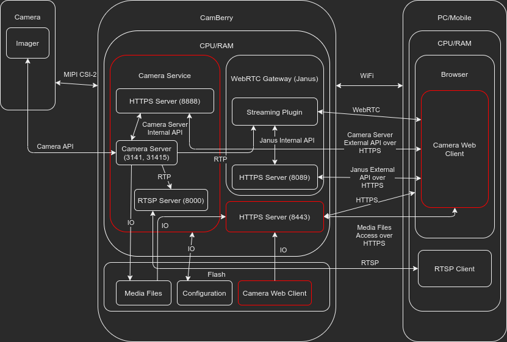

# RaspberryPi-Camera

## Overview

This repository includes:
* Camera Service - service that directly controls Pi Camera Module v2 on 
Raspberry Pi. Camera Service requires custom build of the of the GStreamer,
* Camera Client - WebRTC application that enables streaming of the video from
Camera Service to the browser. Camera Client enables to control most of the Pi 
Camera Module features such as streaming quality parameters, video effects, 
__*imx219*__ imager settings, video orientation, recording controls.

## Dependencies

This repository depends on:
* [RaspberryPi-Janus-Gateway](https://github.com/raspberrypiexperiments/RaspberryPi-Janus-Gateway),
* [RaspberryPi-GStreamer-1.0](https://github.com/raspberrypiexperiments/RaspberryPi-GStreamer-1.0).


## Architecture



## Screenshoot


## Known supported Web Browsers

* Google Chrome Desktop,
* Google Chrome Mobile,
* Mozilla Firefox Desktop,
* Mozilla Firefox Desktop.

## Known supported Raspberry Pi

* Raspberry Pi Zero,
* Raspberry Pi Zero W,
* Raspberry Pi 3B,
* Raspberry Pi 4B.

## Installation

Installation procedure:

```bash
git clone --recurse-submodules -j$(nproc) https://github.com/raspberrypiexperiments/RaspberryPi-Camera.git
cd RaspberryPi-Camera
make install
```

## Uninstallation

Uninstallation procedure:

```bash
make uninstall
cd ..
sudo rm -rf RaspberryPi-Camera
```

## License

MIT License

Copyright (c) 2021 Marcin Sielski <marcin.sielski@gmail.com>
